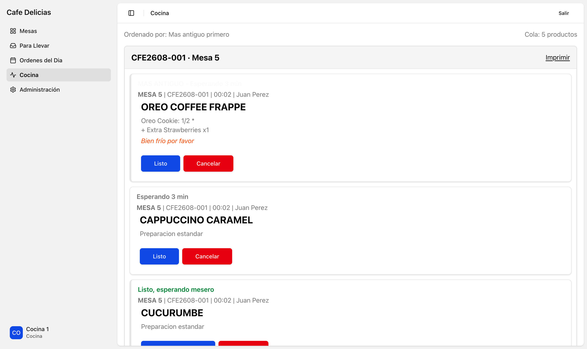
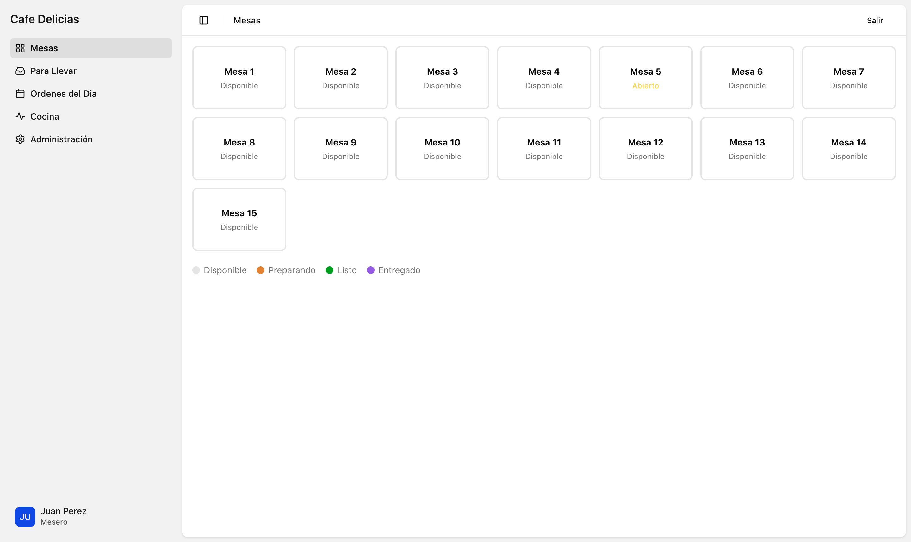
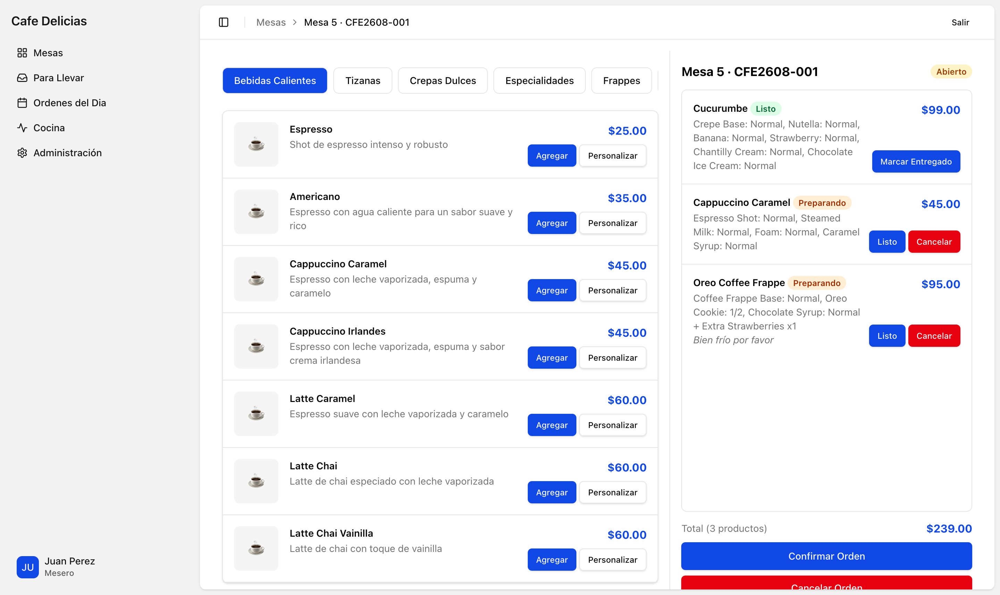
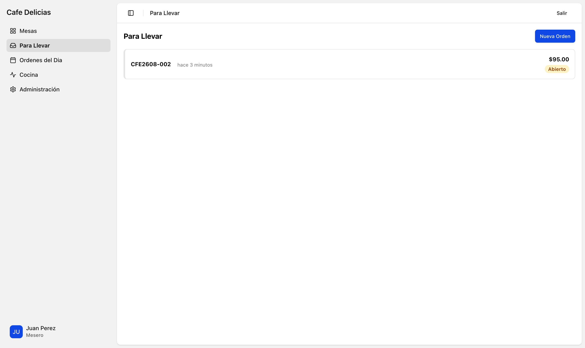
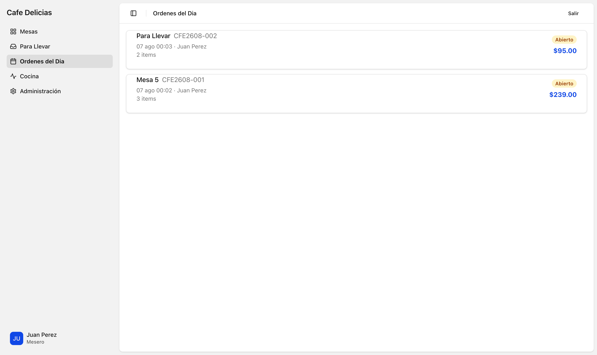
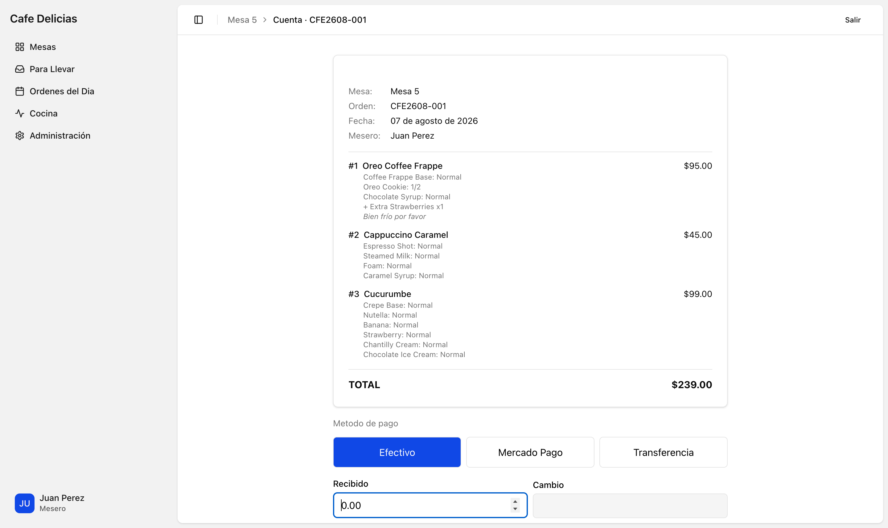
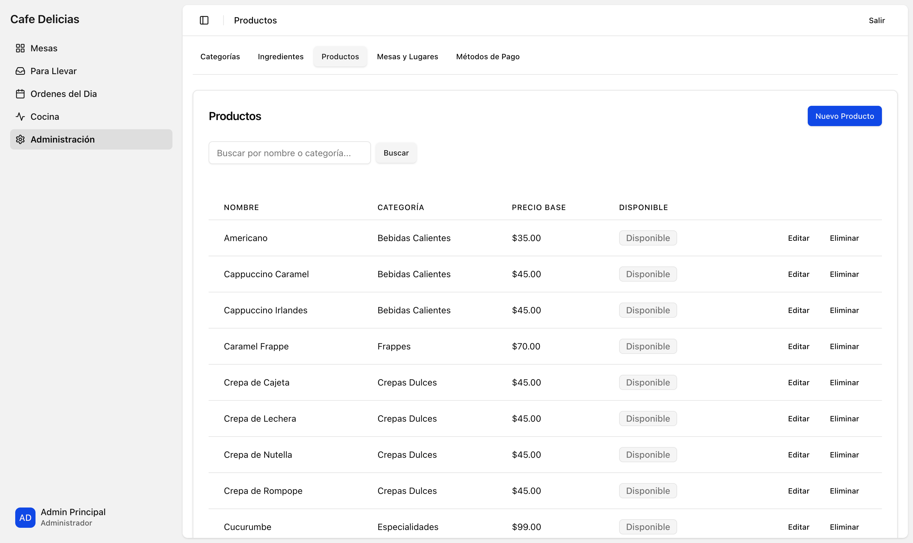
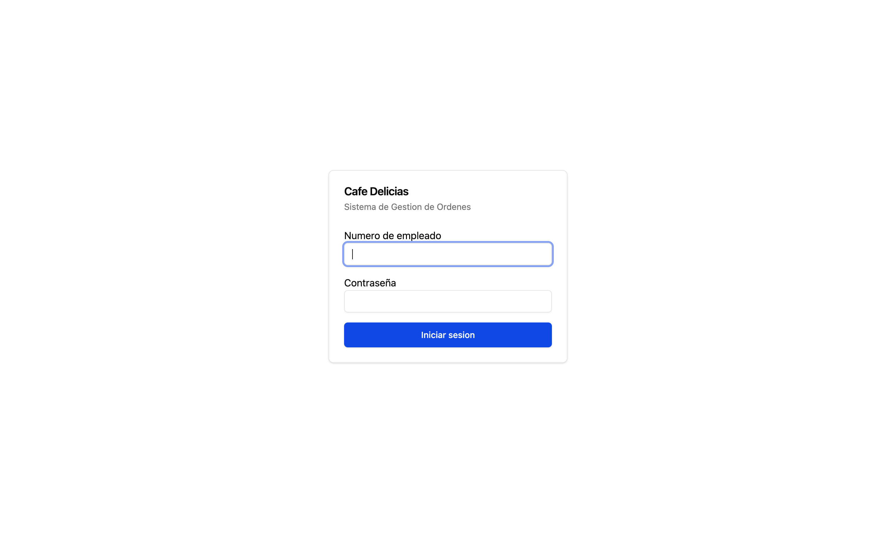

# MayStore

Order management for cafes and restaurants. Waiters build orders at the table, the kitchen works a live queue, and the bill closes out with cash or transfer payments. Multi-tenant by subdomain, Spanish-first.

Built with Rails 8.1 and Hotwire. No SPA, no API layer, no build step for the JavaScript.



## What it does

**Table service.** A floor map shows every table and whether it is free or has an open order. Tap a table to open its order.



**Order building.** Products come from a per-store catalog. Each product has a recipe of components, and the waiter can adjust any ingredient portion (`Sin`, `1/4`, `1/2`, `3/4`, `Normal`) or add paid extras. The same extra can be added several times, so a double chocolate is simply two rows.



**Kitchen queue.** Confirming an order pushes every item to the kitchen at once, oldest first, with the portion changes and notes the waiter entered. Any role can mark an item ready, deliver it, or cancel it. The screen updates over Turbo Streams without a refresh, and there is a print button for a paper ticket.

**Takeout.** Orders that are not tied to a table use a dedicated takeout spot.



**The day's orders.** One list of everything opened today, table and takeout together, with status and running total.



**Billing.** The bill itemizes each line with its portion changes and extras, then takes payment by cash, Mercado Pago, or transfer. Cash payments compute change. Split payments across methods are supported, and a closed order is terminal.



**Admin.** Full CRUD over the catalog: categories, ingredients and extras, products and their recipes, tables, and payment methods.



## How it is put together

**Multitenancy** is by subdomain. `cafe.example.com` and `pizza.example.com` are separate stores with separate catalogs, staff, and orders. Every request resolves `Current.store` from the subdomain, and all queries scope through it.

**Authentication** is split across two models. `Account` holds the employee number and password digest (`has_secure_password`); `User` holds the profile and a `role` of `waiter`, `kitchen`, or `admin`. Staff sign in with an employee number, not an email.

**Role picks the landing screen, not permissions.** A waiter lands on the tables map and the kitchen lands on the queue, but every role can perform every item action. This is deliberate: in a small cafe whoever is closest to the plate marks it ready.

**Order codes** are `{PREFIX}{YY}{MM}-{SEQUENCE}`, for example `CFE2608-001`. Sequences reset monthly and come from an `OrderCounter` row per store per month, allocated under an advisory lock so concurrent inserts cannot collide.

**Money** is integer cents everywhere, with a `PriceCents` concern for the helpers. No money gem.

**Soft delete** is a `deleted_at` column plus explicit scopes such as `Product.active`. Never `default_scope`.

**Status flows:**

```
Order:  open -> cooking -> ready -> delivered -> closed
                                             \-> cancelled

Item:   ordering -> cooking -> ready -> delivered
                            \-> cancelled
```

An order advances automatically when its items do. Once every item is ready or cancelled the order is ready; once every item is delivered or cancelled the order is delivered.

## Running it

Requires Ruby 4.0.6 (see `.ruby-version`) and PostgreSQL.

```bash
bin/setup
bin/rails db:seed
bin/rails server
```

Seeds create two stores so you can exercise multitenancy, along with a full catalog and sample orders.

The app resolves the store from the subdomain, so `localhost:3000` will not find a store. Use a subdomain host instead:

```
http://cafe.localhost:3000    # Cafe Delicias
http://pizza.localhost:3000   # Pizzeria Don Mario
```

Sign in with an employee number and the password `password123`:

| Employee number | Role |
|---|---|
| `EMP-001` | Waiter |
| `KIT-001` | Kitchen |
| `ADM-001` | Admin |



Note that `lvh.me` does not work out of the box. Rails' default `tld_length` of 1 reads `cafe.lvh.me` as the subdomain `cafe.lvh`, which matches no store.

## Development

```bash
bin/rails test      # Minitest, fixtures
bin/rubocop         # rails-omakase
bin/brakeman        # security scan
```

## Documentation

`docs/` holds the detail:

| Path | Contents |
|---|---|
| [docs/README.md](docs/README.md) | Full project documentation and design decisions |
| [docs/references/models.md](docs/references/models.md) | ER diagram, every model, status flows |
| [docs/references/wireframes.md](docs/references/wireframes.md) | Wireframes for all screens |
| [docs/references/turbo-streams.md](docs/references/turbo-streams.md) | Broadcast channels and Turbo Stream architecture |
| [docs/references/reference-patterns.md](docs/references/reference-patterns.md) | Patterns borrowed from the Fizzy codebase |
| [docs/plans/](docs/plans/) | Implementation plans (`backlog`, `in_progress`, `done`) and `decisions/` |
