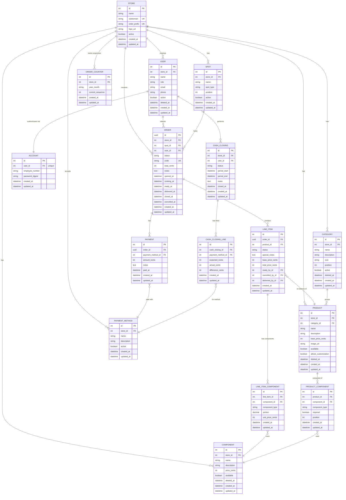

# MayStore - Models and Relationships

**Version:** 5.0
**Last Updated:** March 2026

---

## 1. Application Overview

**MayStore** is a multitenancy order management system for food and beverage businesses.

### Tech Stack

| Technology | Version |
|------------|---------|
| Ruby | Latest |
| Ruby on Rails | 8.1 |
| Database | PostgreSQL |
| Authentication | Rails 8 built-in (`has_secure_password` on Account) |
| Frontend | Hotwire (Turbo + Stimulus) |
| Multitenancy | Subdomain-based (`storeone.store.com`, `storetwo.store.com`) |
| Money | Manual (prices in cents) |
| I18n | Rails built-in, default: `:es` |

---

## 2. Entity-Relationship Diagram



---

## 3. Status Flows

### Statuses are string enums (no lookup tables)

Status is stored as a string column with Rails `enum`. No join tables needed. All labels come from I18n locale files.

### 3.1 Order Status

```
OPEN -> COOKING -> READY -> DELIVERED -> CLOSED
                                      \-> CANCELLED
```

| Status | Color | Hex | I18n key |
|--------|-------|-----|----------|
| open | Yellow | `#FCD34D` | `order_statuses.open` |
| cooking | Orange | `#F97316` | `order_statuses.cooking` |
| ready | Green | `#22C55E` | `order_statuses.ready` |
| delivered | Purple | `#A855F7` | `order_statuses.delivered` |
| closed | Gray | `#6B7280` | `order_statuses.closed` |
| cancelled | Red | `#EF4444` | `order_statuses.cancelled` |

### 3.2 Item Status

```
ORDERING -> COOKING -> READY -> DELIVERED
                    \-> CANCELLED
```

| Status | Color | Hex | I18n key |
|--------|-------|-----|----------|
| ordering | Yellow | `#FCD34D` | `item_statuses.ordering` |
| cooking | Orange | `#F97316` | `item_statuses.cooking` |
| ready | Green | `#22C55E` | `item_statuses.ready` |
| delivered | Purple | `#A855F7` | `item_statuses.delivered` |
| cancelled | Red | `#EF4444` | `item_statuses.cancelled` |

### 3.3 Status Transition Logic

See full model code in sections 10.5 (Order) and 10.6 (LineItem). Key methods:

- `Order#confirm!` — transitions order + all items to COOKING
- `Order#check_ready!` / `#check_delivered!` — SQL-based (`EXISTS`), auto-triggered by LineItem callbacks
- `Order#cancel!` — cancels order + all non-delivered items
- `LineItem#mark_ready!` / `#mark_delivered!` / `#cancel!` — single item transitions
- `LineItem` auto-recalculates order total and checks order status on save

### 3.4 Complete Kitchen Workflow

```
1. Waiter builds order (OPEN)
   +-- Items: ORDERING

2. Waiter CONFIRMS order
   +-- Order: COOKING
   +-- ALL items: COOKING (automatic transition)
   +-- Items appear in kitchen queue (oldest first)

3. Any role sees items in queue (oldest first)
   +-- Items already COOKING
   +-- NO "Start Cooking" button needed
   +-- Any role can: MARK READY, CANCEL, or DELIVER

4. Individual items can be:
   |-- Item 1 -> READY
   |-- Item 2 -> CANCELLED
   +-- Item 3 -> READY

5. When ALL items are READY or CANCELLED:
   +-- Order -> READY

6. Any role delivers items individually:
   |-- Item 1 -> DELIVERED
   +-- Item 3 -> DELIVERED

7. When ALL items are DELIVERED or CANCELLED:
   +-- Order -> DELIVERED

8. Payment recorded:
   +-- Order -> CLOSED
```

### 3.5 Adding Items to a Cooking/Ready Order

```ruby
class Order < ApplicationRecord
  def add_item!(product:, special_notes: nil)
    update!(status: :cooking) if ready?

    item = line_items.create!(
      product: product,
      status: :cooking,
      base_price_cents: product.base_price_cents,
      special_notes: special_notes
    )
    # Create LineItemComponents from params...
    item.calculate_total!
    # order total auto-recalculated via LineItem callback
    item
  end
end
```

---

## 4. Order Code Generation

### Format

```
{STORE_CODE_PREFIX}{YY}{MM}-{SEQUENCE}

Examples:
- CFE2601-001  -> Cafe Delicias, January 2026, order 1
- CFE2601-042  -> Cafe Delicias, January 2026, order 42
- MIA2602-001  -> Mi Cafe, February 2026, order 1 (monthly reset)
```

### Implementation (with OrderCounter table)

Uses a dedicated `OrderCounter` table instead of scanning orders. Atomic increment via `UPDATE ... RETURNING`.

```ruby
# OrderCounter — one row per store per month
# Fields: id, store_id, year_month (string "2601"), current_sequence (integer)
# Unique index on (store_id, year_month)

class Order < ApplicationRecord
  belongs_to :store
  before_create :generate_code

  private

  def generate_code
    return if code.present?

    prefix = store.order_prefix
    year_month = Time.current.strftime("%y%m")

    counter = OrderCounter.find_or_create_by!(store_id: store_id, year_month: year_month) do |c|
      c.current_sequence = 0
    end

    # Atomic increment — no advisory lock needed
    result = OrderCounter.where(id: counter.id)
                         .update_all("current_sequence = current_sequence + 1")
    counter.reload

    self.code = "#{prefix}#{year_month}-#{counter.current_sequence.to_s.rjust(3, '0')}"
  end
end
```

---

## 5. Price Handling (Cents, No Gem)

```ruby
# app/models/concerns/price_cents.rb
module PriceCents
  extend ActiveSupport::Concern

  class_methods do
    def price_in_cents(*attributes)
      attributes.each do |attr|
        cents_attr = "#{attr}_cents"

        define_method(attr) do
          send(cents_attr) / 100.0
        end

        define_method("#{attr}=") do |dollars|
          send("#{cents_attr}=", (dollars.to_f * 100).round)
        end

        define_method("formatted_#{attr}") do
          "$#{'%.2f' % send(attr)}"
        end
      end
    end
  end
end
```

---

## 6. Portion vs Quantity

|             | Portion (how much)       | Quantity (how many)        |
|-------------|--------------------------|----------------------------|
| Ingredients | 0, 1/4, 1/2, 3/4, 1     | Always 1 (implicit)        |
| Extras      | Always 1.0 (implicit)    | 1, 2, 3... via `[- N +]`  |

### 6.1 Ingredient Portions

Portion affects preparation only, NOT price. UI uses discrete buttons.

**Required ingredients** (`required: true`):

| Button | portion | I18n key |
|--------|---------|----------|
| 1st | 0.25 | `portions.quarter` |
| 2nd | 0.5 | `portions.half` |
| 3rd | 0.75 | `portions.three_quarters` |
| 4th | 1.0 | `portions.full` (default, pre-selected) |

No "Sin" button — the ingredient is always present.

**Optional ingredients** (`required: false`):

| Button | portion | I18n key |
|--------|---------|----------|
| 1st | 0.0 | `portions.none` |
| 2nd | 0.25 | `portions.quarter` |
| 3rd | 0.5 | `portions.half` |
| 4th | 0.75 | `portions.three_quarters` |
| 5th | 1.0 | `portions.full` (default, pre-selected) |

### 6.2 Extra Quantities

Extras use an add/remove counter. Each "add" creates one `LineItemComponent` record with `portion: 1.0`.

- Same extra can be added **multiple times** (double extra chocolate = 2 records)
- Price is flat per record (`unit_price_cents`)
- Removing decrements the count (deletes one record)
- **No unique index** on `(line_item_id, component_id)` — duplicates allowed

```ruby
# Double extra chocolate ($10 each)
LineItemComponent.create!(line_item: item, component: chocolate, component_type: :extra, portion: 1.0, unit_price_cents: 1000)
LineItemComponent.create!(line_item: item, component: chocolate, component_type: :extra, portion: 1.0, unit_price_cents: 1000)
# => 2 records, total extras cost: $20
```

---

## 7. Required Ingredients

`required` boolean on `ProductComponent` (replaces old `is_default`):

| component_type | required | Portion UI | Example |
|----------------|----------|------------|---------|
| ingredient | `true` | `(1/4) (1/2) (3/4) [Normal]` | Milk in chocomilk — always present |
| ingredient | `false` | `(Sin) (1/4) (1/2) (3/4) [Normal]` | Whipped cream — can be removed |
| extra | `false` | `[-] [+]` with quantity indicator | Extra chocolate — add 0, 1, 2... |

Extras always have `required: false`.

---

## 8. Soft Delete (No default_scope)

```ruby
# app/models/concerns/soft_deletable.rb
module SoftDeletable
  extend ActiveSupport::Concern

  included do
    scope :active, -> { where(deleted_at: nil) }
    scope :deleted, -> { where.not(deleted_at: nil) }
  end

  def soft_delete!
    update_columns(deleted_at: Time.current)
  end

  def restore!
    update_columns(deleted_at: nil)
  end

  def deleted?
    deleted_at.present?
  end
end
```

Applied to: **User**, **Product**, **Component**, **Category**.

No `default_scope` — always use explicit scopes: `Product.active`, `User.active`, `Component.deleted`. This avoids hidden filtering in joins and eager loads.

---

## 9. Current (37signals Convention)

```ruby
# app/models/current.rb
class Current < ActiveSupport::CurrentAttributes
  attribute :store, :user
end
```

Set in `ApplicationController`:

```ruby
class ApplicationController < ActionController::Base
  before_action :set_current_store
  before_action :set_current_user

  private

  def set_current_store
    Current.store = Store.find_by!(subdomain: request.subdomain)
  end

  def set_current_user
    Current.user = User.find_by(id: session[:user_id]) if session[:user_id]
  end
end
```

Used throughout the app: `Current.store`, `Current.user`.

---

## 10. Model Details

### 10.1 Store

| Field | Type | Description |
|-------|------|-------------|
| id | integer | PK |
| name | string | Store name |
| subdomain | string | Unique subdomain |
| order_prefix | string | Order code prefix (e.g., "CFE") |
| logo_url | string | Logo URL |
| active | boolean | Active status |

```ruby
class Store < ApplicationRecord
  has_many :users
  has_many :spots
  has_many :categories
  has_many :components
  has_many :products
  has_many :orders
  has_many :payment_methods
  has_many :cash_closings

  normalizes :subdomain, with: -> { it.strip.downcase }
  normalizes :order_prefix, with: -> { it.strip.upcase }

  validates :name, presence: true
  validates :subdomain, presence: true, uniqueness: true
  validates :order_prefix, presence: true, uniqueness: true, length: { maximum: 5 }
end
```

---

### 10.2 Account (Authentication)

| Field | Type | Description |
|-------|------|-------------|
| id | integer | PK |
| user_id | integer | FK to User (unique) |
| employee_number | string | Login identifier, unique per store |
| password_digest | string | For `has_secure_password` |

```ruby
class Account < ApplicationRecord
  belongs_to :user
  has_secure_password

  normalizes :employee_number, with: -> { it.strip.upcase }

  validates :employee_number, presence: true
  validates :user_id, uniqueness: true

  validate :employee_number_unique_in_store

  private

  def employee_number_unique_in_store
    existing = Account.joins(:user)
                      .where(users: { store_id: user.store_id })
                      .where(employee_number: employee_number)
                      .where.not(id: id)
    errors.add(:employee_number, :taken) if existing.exists?
  end
end
```

**Login flow:**
```ruby
# 1. Current.store already set by ApplicationController from subdomain

# 2. Find account by employee_number within the store
account = Account.joins(:user)
                 .where(users: { store_id: Current.store.id })
                 .find_by(employee_number: params[:employee_number])

# 3. Authenticate
if account&.authenticate(params[:password])
  session[:user_id] = account.user_id
  redirect_by_role(account.user)
end

# 4. Redirect by role (role = default screen, not permissions)
def redirect_by_role(user)
  case user.role
  when "waiter"  then redirect_to spots_path
  when "kitchen" then redirect_to kitchen_path
  when "admin"   then redirect_to admin_dashboard_path
  end
end
```

---

### 10.3 User

| Field | Type | Description |
|-------|------|-------------|
| id | integer | PK |
| store_id | integer | FK to Store |
| name | string | Display name |
| role | string | Enum: waiter, kitchen, admin |
| email | string | Contact email |
| phone | string | Contact phone |
| active | boolean | Active status |
| deleted_at | datetime | Soft delete timestamp |

```ruby
class User < ApplicationRecord
  include SoftDeletable

  belongs_to :store
  has_one :account, dependent: :destroy
  has_many :orders
  has_many :cash_closings

  enum :role, {
    waiter: "waiter",
    kitchen: "kitchen",
    admin: "admin"
  }

  normalizes :email, with: -> { it.strip.downcase }

  validates :name, presence: true
  validates :role, presence: true

  def role_label
    I18n.t("roles.#{role}")
  end
end
```

---

### 10.4 Spot

| Field | Type | Description |
|-------|------|-------------|
| id | integer | PK |
| store_id | integer | FK to Store |
| name | string | Display name (e.g., "Mesa 5", "Para llevar") |
| spot_type | string | Enum: dine_in, takeout |
| position | integer | Display order |
| active | boolean | Active status |

```ruby
class Spot < ApplicationRecord
  belongs_to :store
  has_many :orders

  enum :spot_type, { dine_in: "dine_in", takeout: "takeout" }

  validates :name, presence: true, uniqueness: { scope: :store_id }
  validates :spot_type, presence: true

  scope :tables, -> { where(spot_type: :dine_in) }
  scope :takeouts, -> { where(spot_type: :takeout) }

  def self.takeout_for(store)
    find_or_create_by!(store: store, spot_type: :takeout) do |spot|
      spot.name = I18n.t("spot_types.takeout")
    end
  end
end
```

---

### 10.5 Order

| Field | Type | Description |
|-------|------|-------------|
| id | uuid | PK (UUID) |
| store_id | integer | FK to Store |
| spot_id | integer | FK to Spot |
| user_id | integer | FK to User |
| status | string | Enum: open, cooking, ready, delivered, closed, cancelled |
| code | string | Human code (e.g., "CFE2601-001") |
| total_cents | integer | Final total (sum of non-cancelled line item totals) |
| notes | text | General notes |
| opened_at | datetime | Opened timestamp |
| cooking_at | datetime | Cooking started timestamp |
| ready_at | datetime | Ready timestamp |
| delivered_at | datetime | Delivered timestamp |
| closed_at | datetime | Closed timestamp |
| cancelled_at | datetime | Cancelled timestamp |

```ruby
class Order < ApplicationRecord
  include PriceCents

  belongs_to :store
  belongs_to :spot
  belongs_to :user
  has_many :line_items, dependent: :destroy
  has_many :payments, dependent: :destroy

  enum :status, {
    open: "open",
    cooking: "cooking",
    ready: "ready",
    delivered: "delivered",
    closed: "closed",
    cancelled: "cancelled"
  }

  STATUS_COLORS = {
    "open" => "#FCD34D",
    "cooking" => "#F97316",
    "ready" => "#22C55E",
    "delivered" => "#A855F7",
    "closed" => "#6B7280",
    "cancelled" => "#EF4444"
  }.freeze

  before_create :generate_code

  price_in_cents :total

  def status_label
    I18n.t("order_statuses.#{status}")
  end

  def status_color
    STATUS_COLORS[status]
  end

  def recalculate_total!
    update_columns(total_cents: line_items.where.not(status: :cancelled).sum(:total_price_cents))
  end

  def confirm!
    transaction do
      update!(status: :cooking, cooking_at: Time.current)
      line_items.where(status: :ordering).update_all(status: :cooking)
    end
  end

  def check_ready!
    return unless cooking?
    unfinished = line_items.where.not(status: [:ready, :delivered, :cancelled]).exists?
    update!(status: :ready, ready_at: Time.current) unless unfinished
  end

  def check_delivered!
    return unless ready?
    unfinished = line_items.where.not(status: [:delivered, :cancelled]).exists?
    update!(status: :delivered, delivered_at: Time.current) unless unfinished
  end

  def close!
    update!(status: :closed, closed_at: Time.current)
  end

  def cancel!
    transaction do
      update!(status: :cancelled, cancelled_at: Time.current)
      line_items.where(status: [:ordering, :cooking, :ready])
                .update_all(status: :cancelled)
    end
  end

  def add_item!(product:, special_notes: nil)
    update!(status: :cooking) if ready?

    item = line_items.create!(
      product: product,
      status: :cooking,
      base_price_cents: product.base_price_cents,
      special_notes: special_notes
    )
    item.calculate_total!
    # order total auto-recalculated via LineItem callback
    item
  end

  def total_paid_cents
    payments.sum(:amount_cents)
  end

  def remaining_cents
    total_cents - total_paid_cents
  end

  def fully_paid?
    remaining_cents <= 0
  end
end
```

---

### 10.6 LineItem

| Field | Type | Description |
|-------|------|-------------|
| id | integer | PK |
| order_id | uuid | FK to Order |
| product_id | integer | FK to Product |
| status | string | Enum: ordering, cooking, ready, delivered, cancelled |
| special_notes | text | Special instructions |
| base_price_cents | integer | Product base price (snapshot) |
| total_price_cents | integer | base + extras |
| ready_by_id | integer | FK to User — who marked ready (nullable) |
| cancelled_by_id | integer | FK to User — who cancelled (nullable) |
| delivered_by_id | integer | FK to User — who delivered (nullable) |

```ruby
class LineItem < ApplicationRecord
  include PriceCents

  belongs_to :order
  belongs_to :product
  has_many :line_item_components, dependent: :destroy

  enum :status, {
    ordering: "ordering",
    cooking: "cooking",
    ready: "ready",
    delivered: "delivered",
    cancelled: "cancelled"
  }

  STATUS_COLORS = {
    "ordering" => "#FCD34D",
    "cooking" => "#F97316",
    "ready" => "#22C55E",
    "delivered" => "#A855F7",
    "cancelled" => "#EF4444"
  }.freeze

  after_update :check_order_status, if: :saved_change_to_status?
  after_save :recalculate_order_total, if: :saved_change_to_total_price_cents?
  after_destroy :recalculate_order_total

  price_in_cents :base_price, :total_price

  def status_label
    I18n.t("item_statuses.#{status}")
  end

  def status_color
    STATUS_COLORS[status]
  end

  def calculate_total!
    extras_total = line_item_components
                     .where(component_type: :extra)
                     .sum(:unit_price_cents)
    self.total_price_cents = base_price_cents + extras_total
    save!
  end

  def mark_ready!
    update!(status: :ready)
  end

  def mark_delivered!
    update!(status: :delivered)
  end

  def cancel!
    update!(status: :cancelled)
  end

  private

  def check_order_status
    order.check_ready!
    order.check_delivered!
  end

  def recalculate_order_total
    order.recalculate_total!
  end
end
```

---

### 10.7 LineItemComponent

| Field | Type | Description |
|-------|------|-------------|
| id | integer | PK |
| line_item_id | integer | FK to LineItem |
| component_id | integer | FK to Component |
| component_type | string | Enum: ingredient, extra |
| portion | decimal | Amount (0.0 - 1.0) |
| unit_price_cents | integer | Copied from component at time of order |

**No unique index** on (line_item_id, component_id) — duplicates allowed for multiple extras.

```ruby
class LineItemComponent < ApplicationRecord
  include PriceCents

  belongs_to :line_item
  belongs_to :component

  enum :component_type, {
    ingredient: "ingredient",
    extra: "extra"
  }

  price_in_cents :unit_price

  PORTION_LABELS = {
    0.0 => "portions.none",
    0.25 => "portions.quarter",
    0.5 => "portions.half",
    0.75 => "portions.three_quarters",
    1.0 => "portions.full"
  }.freeze

  validates :portion, inclusion: { in: [0.0, 0.25, 0.5, 0.75, 1.0] }

  def portion_label
    I18n.t(PORTION_LABELS[portion] || "portions.full")
  end
end
```

---

### 10.8 Product

```ruby
class Product < ApplicationRecord
  include SoftDeletable
  include PriceCents

  belongs_to :store
  belongs_to :category
  has_many :product_components, dependent: :destroy
  has_many :components, through: :product_components

  price_in_cents :base_price

  validates :name, presence: true
  validates :base_price_cents, numericality: { greater_than_or_equal_to: 0 }

  scope :available, -> { where(available: true) }
end
```

---

### 10.9 ProductComponent

| Field | Type | Description |
|-------|------|-------------|
| id | integer | PK |
| product_id | integer | FK to Product |
| component_id | integer | FK to Component |
| component_type | string | Enum: ingredient, extra |
| required | boolean | If true, ingredient cannot be set to portion 0 |
| position | integer | Display order in customization UI |

```ruby
class ProductComponent < ApplicationRecord
  belongs_to :product
  belongs_to :component

  enum :component_type, {
    ingredient: "ingredient",
    extra: "extra"
  }

  scope :ordered, -> { order(:position) }

  # required: true  -> ingredient always present (no "Sin" button)
  # required: false  -> ingredient can be removed / extra can be 0
  # Extras always have required: false
end
```

---

### 10.10 Component

```ruby
class Component < ApplicationRecord
  include SoftDeletable
  include PriceCents

  belongs_to :store
  has_many :product_components, dependent: :destroy

  price_in_cents :price

  validates :name, presence: true

  scope :available, -> { where(available: true) }
  scope :ingredients, -> { where(price_cents: 0) }
  scope :extras, -> { where("price_cents > 0") }
end
```

---

### 10.11 Category

```ruby
class Category < ApplicationRecord
  include SoftDeletable

  belongs_to :store
  has_many :products

  validates :name, presence: true

  scope :ordered, -> { order(:position) }
end
```

---

### 10.12 Payment

```ruby
class Payment < ApplicationRecord
  include PriceCents

  belongs_to :order
  belongs_to :payment_method

  price_in_cents :amount

  validates :amount_cents, numericality: { greater_than: 0 }
end
```

Multiple payments per order supported for split payments.

---

### 10.13 PaymentMethod

```ruby
class PaymentMethod < ApplicationRecord
  belongs_to :store
  has_many :payments

  validates :name, presence: true

  scope :active, -> { where(active: true) }
end
```

---

### 10.14 CashClosing (Corte de Caja)

| Field | Type | Description |
|-------|------|-------------|
| id | integer | PK |
| store_id | integer | FK to Store |
| user_id | integer | FK to User (admin who performed it) |
| status | string | Enum: open, closed |
| period_start | datetime | Start of period being audited |
| period_end | datetime | End of period being audited |
| notes | text | Admin notes |
| closed_at | datetime | When the closing was finalized |

```ruby
class CashClosing < ApplicationRecord
  include PriceCents

  belongs_to :store
  belongs_to :user
  has_many :cash_closing_lines, dependent: :destroy

  enum :status, {
    open: "open",
    closed: "closed"
  }

  validates :period_start, presence: true
  validates :period_end, presence: true

  def status_label
    I18n.t("cash_closing_statuses.#{status}")
  end

  # Auto-calculate expected amounts from closed orders in the period
  def calculate_expected!
    store.payment_methods.active.each do |pm|
      expected = Payment.joins(:order)
                        .where(orders: { store_id: store_id, status: :closed })
                        .where(payment_method: pm)
                        .where(paid_at: period_start..period_end)
                        .sum(:amount_cents)

      line = cash_closing_lines.find_or_initialize_by(payment_method: pm)
      line.expected_cents = expected
      line.save!
    end
  end

  def total_expected_cents
    cash_closing_lines.sum(:expected_cents)
  end

  def total_actual_cents
    cash_closing_lines.sum(:actual_cents)
  end

  def total_difference_cents
    cash_closing_lines.sum(:difference_cents)
  end

  price_in_cents :total_expected, :total_actual, :total_difference

  def close!
    update!(status: :closed, closed_at: Time.current)
  end
end
```

---

### 10.15 CashClosingLine

| Field | Type | Description |
|-------|------|-------------|
| id | integer | PK |
| cash_closing_id | integer | FK to CashClosing |
| payment_method_id | integer | FK to PaymentMethod |
| expected_cents | integer | Calculated from orders |
| actual_cents | integer | Admin-entered amount |
| difference_cents | integer | actual - expected |

```ruby
class CashClosingLine < ApplicationRecord
  include PriceCents

  belongs_to :cash_closing
  belongs_to :payment_method

  price_in_cents :expected, :actual, :difference

  before_save :calculate_difference

  private

  def calculate_difference
    self.difference_cents = (actual_cents || 0) - (expected_cents || 0)
  end
end
```

---

## 11. Database Indexes

```sql
-- Stores
CREATE UNIQUE INDEX idx_stores_subdomain ON stores(subdomain);
CREATE UNIQUE INDEX idx_stores_order_prefix ON stores(order_prefix);
CREATE INDEX idx_stores_active ON stores(active);

-- Accounts
CREATE UNIQUE INDEX idx_accounts_user_id ON accounts(user_id);
CREATE INDEX idx_accounts_employee_number ON accounts(employee_number);

-- Users
CREATE INDEX idx_users_store ON users(store_id);
CREATE INDEX idx_users_role ON users(store_id, role);
CREATE INDEX idx_users_deleted_at ON users(deleted_at);

-- Spots
CREATE UNIQUE INDEX idx_spots_name ON spots(store_id, name);
CREATE INDEX idx_spots_store ON spots(store_id);
CREATE INDEX idx_spots_spot_type ON spots(store_id, spot_type);
CREATE INDEX idx_spots_position ON spots(store_id, position);

-- Categories
CREATE INDEX idx_categories_store ON categories(store_id);
CREATE INDEX idx_categories_position ON categories(store_id, position);
CREATE INDEX idx_categories_deleted_at ON categories(deleted_at);

-- Products
CREATE INDEX idx_products_store ON products(store_id);
CREATE INDEX idx_products_category ON products(category_id);
CREATE INDEX idx_products_available ON products(store_id, available);
CREATE INDEX idx_products_deleted_at ON products(deleted_at);

-- Components
CREATE INDEX idx_components_store ON components(store_id);
CREATE INDEX idx_components_available ON components(store_id, available);
CREATE INDEX idx_components_deleted_at ON components(deleted_at);

-- Product Components
CREATE UNIQUE INDEX idx_product_component ON product_components(product_id, component_id, component_type);

-- Orders
CREATE UNIQUE INDEX idx_orders_code ON orders(store_id, code);
CREATE INDEX idx_orders_store ON orders(store_id);
CREATE INDEX idx_orders_spot ON orders(spot_id);
CREATE INDEX idx_orders_status ON orders(store_id, status);
CREATE INDEX idx_orders_created_at ON orders(created_at);

-- Line Items
CREATE INDEX idx_line_items_order ON line_items(order_id);
CREATE INDEX idx_line_items_status ON line_items(status);
CREATE INDEX idx_line_items_created_at ON line_items(created_at);

-- Line Item Components (NO unique index — duplicates allowed for multiple extras)
CREATE INDEX idx_line_item_components_line_item ON line_item_components(line_item_id);

-- Payment Methods
CREATE INDEX idx_payment_methods_store ON payment_methods(store_id);

-- Payments
CREATE INDEX idx_payments_order ON payments(order_id);
CREATE INDEX idx_payments_method_paid_at ON payments(payment_method_id, paid_at);

-- Order Counters
CREATE UNIQUE INDEX idx_order_counters_store_month ON order_counters(store_id, year_month);

-- Cash Closings
CREATE INDEX idx_cash_closings_store ON cash_closings(store_id);
CREATE INDEX idx_cash_closings_period ON cash_closings(store_id, period_start, period_end);

-- Cash Closing Lines
CREATE INDEX idx_cash_closing_lines_closing ON cash_closing_lines(cash_closing_id);
```

---

## 12. Model Chain: Template vs Instance

There are two layers of models that mirror each other:

| Template (catalog) | Instance (order) | Purpose |
|---------------------|-------------------|---------|
| **Product** | **LineItem** | The item itself |
| **ProductComponent** | **LineItemComponent** | Its components |
| **Component** | **Component** | Shared (referenced by both) |

- **Component** = a reusable ingredient or extra (e.g., "Nutella", "Extra Chocolate"). Defined once in the store catalog.
- **Product** = a menu item (e.g., "Crepa de Nutella", $45). Defined once in the catalog.
- **ProductComponent** = the **template/recipe** — links Product to Component, defining what ingredients and extras are available for that product, and whether each is `required`. Used by the UI to render the customization screen. Not referenced after ordering.
- **LineItem** = an **instance** of a Product in a specific order. Snapshots `base_price_cents` from the product at order time.
- **LineItemComponent** = an **instance** of a Component in a specific line item. Records the customer's actual customization (portion for ingredients, one record per unit for extras). Snapshots `unit_price_cents` from the component at order time.

### Example: "Crepa de Nutella with extra Cajeta filling and double extra chocolate"

**Step 1: Catalog defines the template (already exists in DB)**

```ruby
# Product
crepa_nutella = Product.find_by(name: "Crepa de Nutella")
# => base_price_cents: 4500

# ProductComponents (the recipe — what the UI shows for customization)
# These tell the UI: "this product has these ingredients and extras"
crepa_nutella.product_components
# => [
#   { component: "Crepe Base",             component_type: :ingredient, required: true  },
#   { component: "Nutella",                component_type: :ingredient, required: true  },
#   { component: "Relleno Extra Nutella",  component_type: :extra,      required: false },
#   { component: "Relleno Extra Cajeta",   component_type: :extra,      required: false },
#   { component: "Relleno Extra Lechera",  component_type: :extra,      required: false },
#   { component: "Relleno Extra Rompope",  component_type: :extra,      required: false },
#   { component: "Extra Ice Cream",        component_type: :extra,      required: false },
#   ...
# ]
```

**Step 2: Waiter creates the order (instances are created)**

```ruby
# Order
order = Order.create!(
  store: Current.store,
  spot: table_5,
  user: Current.user,
  status: :open
)
# => code: "CFE2601-001" (auto-generated)

# LineItem — instance of the Product, price snapshot
item = LineItem.create!(
  order: order,
  product: crepa_nutella,
  status: :ordering,
  base_price_cents: crepa_nutella.base_price_cents  # snapshot: 4500
)

# LineItemComponents — instances of Components, customized by customer
# Required ingredients (portion buttons without "Sin")
LineItemComponent.create!(line_item: item, component: crepe_base, component_type: :ingredient, portion: 1.0, unit_price_cents: 0)
LineItemComponent.create!(line_item: item, component: nutella, component_type: :ingredient, portion: 1.0, unit_price_cents: 0)

# Extra filling ($10 — crepe-specific extra, price snapshot)
LineItemComponent.create!(line_item: item, component: relleno_cajeta, component_type: :extra, portion: 1.0, unit_price_cents: 1000)

# Double extra chocolate ($10 each = 2 records, price snapshot)
LineItemComponent.create!(line_item: item, component: extra_chocolate, component_type: :extra, portion: 1.0, unit_price_cents: 1000)
LineItemComponent.create!(line_item: item, component: extra_chocolate, component_type: :extra, portion: 1.0, unit_price_cents: 1000)

# Calculate total: base + extras
item.calculate_total!
# => total_price_cents = 4500 + 1000 + 1000 + 1000 = 7500 ($75.00)
```

**Step 3: Waiter confirms, kitchen sees it**

```ruby
order.confirm!
# Order status -> COOKING
# ALL items status -> COOKING (automatic)
```

```
+-------------------------------------------+
| MESA 5 | CFE2601-001 | 14:35 | Juan       |
+-------------------------------------------+
| [1x] CREPA DE NUTELLA                     |
|                                           |
| Ingredientes:                             |
|   Base Crepa: Normal                      |
|   Nutella: Normal                         |
|                                           |
| Extras:                                   |
|   + Relleno Extra Cajeta x1              |
|   + Extra Chocolate x2                   |
|                                           |
| Estado: PREPARANDO                        |
| [LISTO]  [CANCELAR]                       |
+-------------------------------------------+
```
